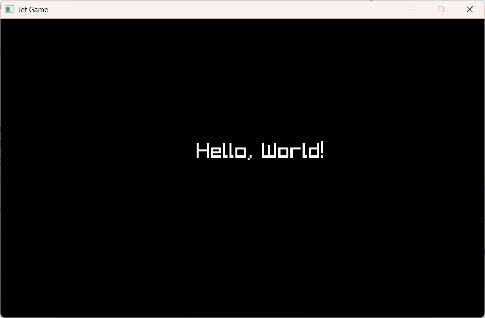
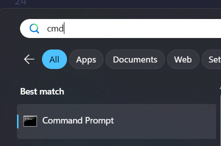
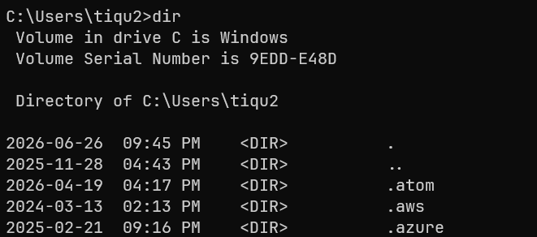

# Lesson One -- Setting Up Your Project
Hate reading? Watch the video for this lesson instead: [https://www.youtube.com/watch?v=dQw4w9WgXcQ](https://www.youtube.com/watch?v=dQw4w9WgXcQ)

We need to setup and/or download/install a few things to setup our project:
1. A terminal such as Command Prompt (Windows) or Terminal (MacOS)
2. A text editor such as VS Code or Notepad++ (Windows Only). 
3. The [Zig](https://ziglang.org/) programming language,
    which you will use as a C compiler and build system.
4. [Raylib](https://github.com/raysan5/raylib) -- an 
    open-source video game programming library.

I am a Windows user, but I will provide relevant instructions for Mac when necessary.

By the end of this lesson, you should be able to create a window like this:

## Terminal
Open your terminal and create a new directory (folder) for this course. Instructions below:

### Windows
Click the Windows Button in the bottom left corner and type "cmd" into the 
search box. "Command Prompt" should appear. Click it to open your terminal.

You should see a window like below. Try typing "dir" and hit Enter.
You should see a list of directory contents. 

### Terminal

Your machine should have a terminal / shell readily available. This text will assume
you are using **Windows Command Prompt**, but the instructions throughout should be 
easy to adapt for any terminal & operating system.

#### Windows 
Type "cmd" into your search bar (usually at the bottom right) and click on "Command Prompt". 
In the window that appears, type "ver" and hit Enter. You should see something like this:
`Microsoft Windows [Version 10.0.26200.8037]`

#### Other Operating Systems
Google search "How to use a terminal on {my operating system}" and follow the instructions. 
Try to get the terminal to tell you its version.

### A Text Editor
Notepad comes pre-installed on Windows. It should suffice for this course, but you may
find it beneficial to install a more feature-complete code editor. I recommend 
[VS Code](https://code.visualstudio.com/) for beginners and [Neovim](https://neovim.io/) 
(my editor of choice) if you like steep learning curves and numerous headaches. 

### Zig
Zig is a modern systems programming language. We will not use the language itself
in this course (although I highly recommend it), but we will use it to compile our
C programs.

Go to [https://ziglang.org/download], scroll down to version **TDB**, and download the
correct zip file for your Operating System. Unzip and add the executable to your PATH.

[Next Lesson -->](../0002/whatever_this_is.md)  
[Back to Index](../../README.md)

