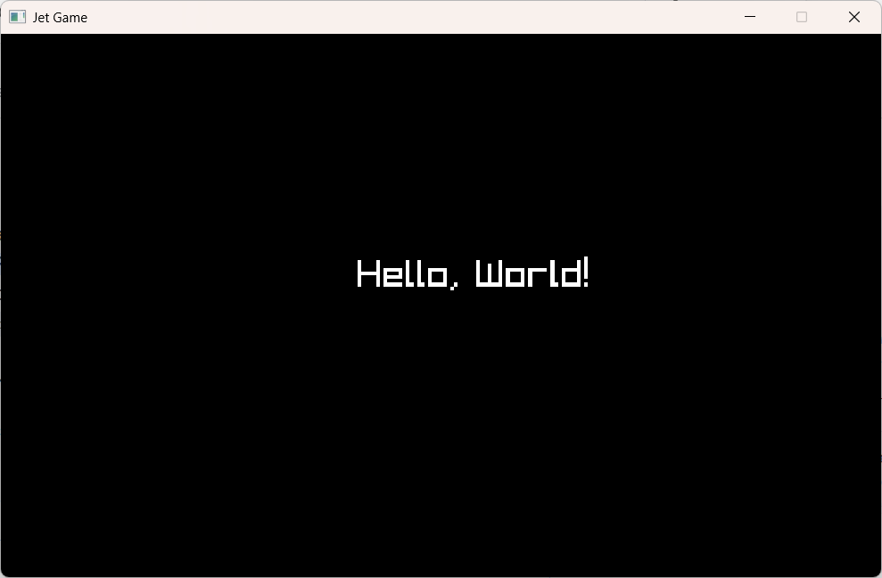
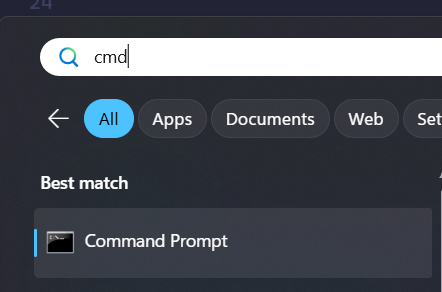
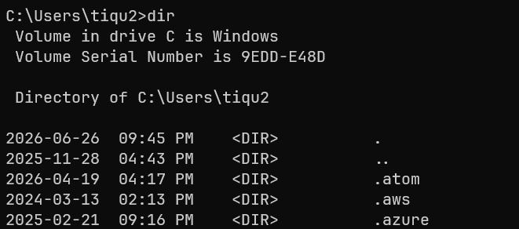

# Lesson One -- Setting Up Your Project
We need to setup and/or download/install a few things to setup our project:
1. A terminal such as Command Prompt (Windows) or Terminal (MacOS)
2. A text editor such as VS Code or Notepad++ (Windows Only). 
3. A C compiler. 
4. [Raylib](https://github.com/raysan5/raylib) -- an 
    open-source video game programming library.

I am a Windows user, but I will provide relevant instructions for Mac when necessary.

By the end of this lesson, you should be able to create a window like this:



## Terminal
Open your terminal and create a new directory (folder) for this course. Instructions below:

### Windows
Click the Windows Button in the bottom left corner and type "cmd" into the 
search box. "Command Prompt" should appear. Click it to open your terminal.



You should see a window like below. Try typing "dir" and hit Enter.
You should see a list of directory contents. 



### Mac
- Press **Command + Spacebar** to open Spotlight.
- Type **Terminal**.
- Press **Return**.

## A Text Editor
I recommend using a very basic text editor for this course.

### Windows
You can use the built-in Notepad, or you can install a third-party
editor such as [Notepad++](https://notepad-plus-plus.org/).

I recommend **Notepad++** for the syntax highlighting. 

### Mac
You can install CotEditor from the Mac App Store. 

## A C Compiler and Raylib
We will work on these together in class. 

## Program
When everything is working from this lesson, you use the [code](code.c) from this lesson.

1. Create a folder called **jet_game** or something similar in a location on your computer.
2. Create a file called **main.c** in that folder. 
3. Copy the contents of [code.c](code.c) into **main.c**.
4. Compile and run the **main.c** file (varies by C compiler).

For example on my machine:
```shell
D:\jet_game > zig build run
```

Now you should see the **Hello, Raylib!** window on your screen.


[Next Lesson -->](../0002/README.md)  
[Back to Index](../../README.md)

