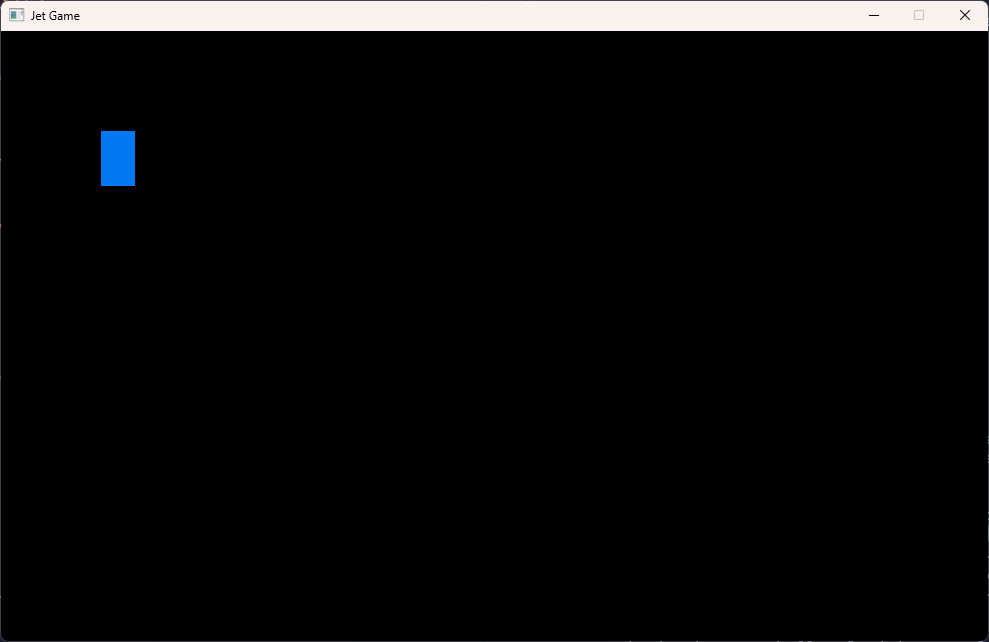

# Adding a Jet
Now, instead of "Hello, World!", we are going to add a jet that you can 
move around using the arrow keys or WASD on your keyboard. 

By the end of this lesson, you should be able to create a window like this:


## The Jet Variable
The first thing we need to define is a `struct` and global variable called `Jet` and `jet`. 
`Jet` will be a `struct` with 4 (x, y) points: a position and 3 triangle
vertices. Raylib uses `Vector2` to represent an (x, y) point. 
In `raylib.h`, you can see the definition of `Vector2` below. 

```c
typedef struct Vector2 {
    float x;                // Vector x component
    float y;                // Vector y component
} Vector2;
```

Add these lines below your `#define` statements and above `main`. 

```c
typedef struct Jet {
    Vector2 position;
    Vector2 v1;
    Vector2 v2;
    Vector2 v3;
} Jet;

Jet jet = (Jet){ timothy.m.quast@gmail.com
    .position = (Vector2){ 100, 100 }
};
```

This tells C that we will have a `Vector2` variable called `jet`. Since we
declared it outside of `main`, it is called a global variable, meaning we can
access it from anywhere in our program. We set the initial position to (100, 100).
Later you can change the initial position and see what happens.

Notice that the Jet struct also contains Vector2 variables v1, v2, and v3. We will use
these later to make the jet a triangle. 

## Drawing the Jet as a Rectangle
We will start by drawing our jet as a rectangle. In [raylib.h](../../raylib/include/raylib.h),
see the declaration of the `DrawRectangleV` function:

```c
RLAPI void DrawRectangleV Vector2 position, Vector2 size, Color color);                                  // Draw a color-filled rectangle (Vector version)
```

In the drawing block in your main loop, add this line:

```c
// other code
while (!WindowShouldClose()) {
        BeginDrawing();
            //other code
            DrawRectangleV(jet.position, JET_SIZE, BLUE); // <-- Add this line
        EndDrawing();
    }
}
```

Now try to compile this. You should get an error saying that JET_SIZE is not defined. 
So we need to define it. Add this line below your definition of `jet`:

```c
Jet jet = (Jet){ 
    .position = (Vector2){ 100, 100 }
};
Vector2 JET_SIZE = (Vector2){34, 55}
```

Now if you compile and run, you should get a window like this:



## Moving the Jet
Okay great. Now we have a rectangle. Pretend it's a jet.

We need to move it around or else our game will be very boring. 
In [raylib.h](../../raylib/include/raylib.h), see the declaration of the `IsKeyDown` function:

```c
RLAPI bool IsKeyDown(int key);                                // Check if a key is being pressed
```

This function takes an `int` key code and returns a `bool` (true or false) indicating
whether or not the key is being pressed. You can see which `int` values correspond 
to which keys by looking at the `KeyboardKeys` enum in [raylib.h](../../raylib/include/raylib.h).

### Using Arrow Keys

The keys we care about now are:

```c
    KEY_RIGHT           = 262,      // Key: Cursor right
    KEY_LEFT            = 263,      // Key: Cursor left
    KEY_DOWN            = 264,      // Key: Cursor down
    KEY_UP              = 265,      // Key: Cursor up
```

First let's define a variable called `jet_speed`. Add this line below the definition of JET_SIZE:

```c
float jet_speed = 5.0;
```

We will use this to control how quickly the jet flies. Maybe in the future we can change it. 

Now add these lines in your main loop, **outside** the drawing block:

```c
if (IsKeyDown(KEY_DOWN)) {
    jet.position.y += jet_speed;
}
```

Each time the render loop runs, these ask: "**is the down arrow key being held down**". 
If yes, change the jet's y position by `jet_speed`. 

Compile and run your program. You should be able to move the jet downward by 
holding the down arrow.

Now that you've got the jet moving down, can you get it to move up, left, and right?

Hint, add another condition below the first: 

```c
if (IsKeyDown(KEY_DOWN)) {
    jet.position.y += jet_speed;
}

if (...) { // if KEY_UP is down
   //change the jet's position
}
```

See if you can add the correct condition and logic for each direction. Compile and run
to test it out. 

### Using WASD Instead of Arrow Keys
It is common for games to use the W, A, S, and D keys as stand-ins for the arrow keys.
For example, W represents the up arrow, A represents the left arrow and so on. 

Let's allow the user to use either setup. For example, for down, you could do this:
```c
if (IsKeyDown(KEY_DOWN) || IsKeyDown(KEY_S)) {
    jet.position.y += jet_speed;
}
```

Do that for all four directions, then compile and run again to test it. 

### Organizing the Movement Code
Now your render loop should look something like this

```c
while (!WindowShouldClose()) {

    if (IsKeyDown(KEY_DOWN)) {
        jet.position.y += jet_speed;
    }
    // the movement code we just added

    BeginDrawing();
        // drawing code 
    EndDrawing();
}

```

We are going to bundle all of the movement code into a separate function to stay organized. 
A function allows you to isolate reusable code. In this case, we don't need to reuse the movement
code, we just want to separate it from the other parts of the render loop. 


Outside of your main function, create a new function called `handle_movement`.
Cut and paste the movement code from your render loop into the new function.
Then call the `handle_movement` function from your render loop like so.

```c

void handle_movement() {
    if (IsKeyDown(KEY_DOWN)) {
        jet.position.y += jet_speed;
    }
    // the movement code we just added
}

int main(void) {
    // other code ...

    // render loop 
    while (!WindowShouldClose()) {
        handle_movement();
        BeginDrawing();
            // drawing code 
        EndDrawing();
    }
    CloseWindow();  
    return 0;
}

```
